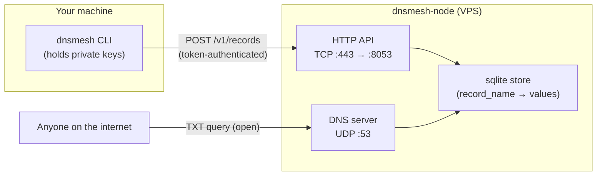
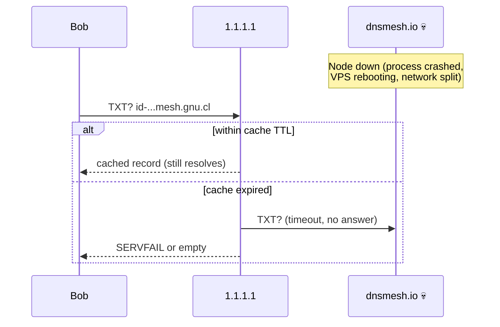
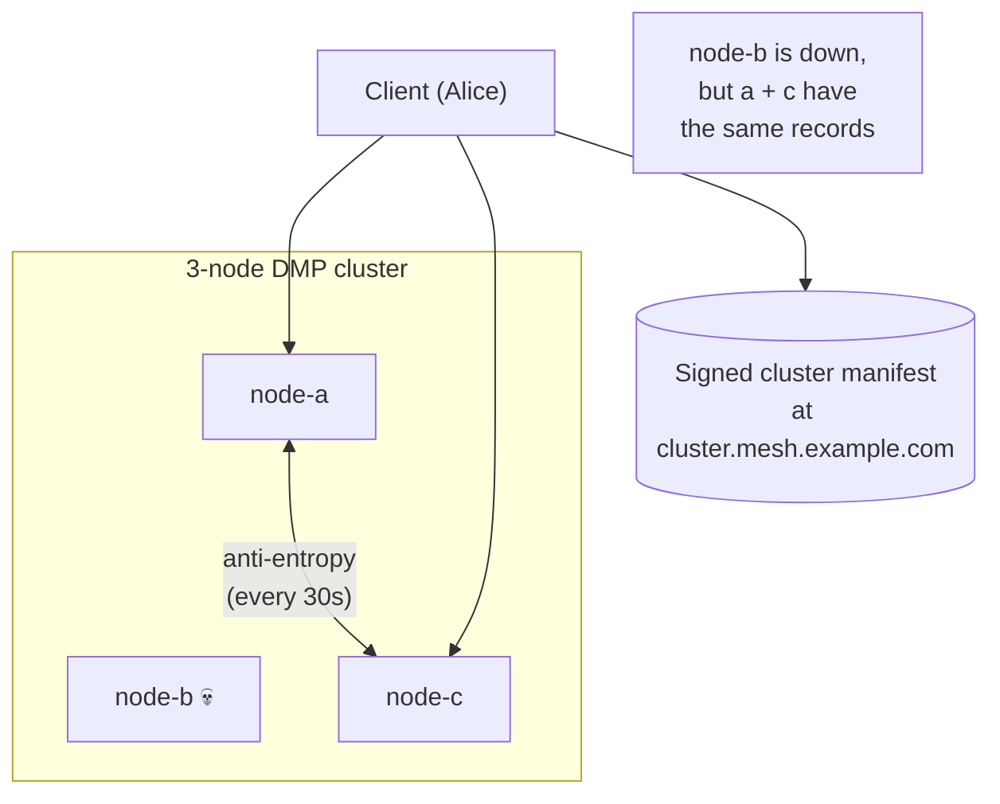

# How resolution works
{: .no_toc }

1. TOC
{:toc}

A walkthrough of what happens at the wire level when you publish or
fetch a DMP record. Covers the two-plane architecture, the resolver
chain, and what fails when a node goes offline.

## Two planes, one sqlite store

The whole system has exactly two interfaces:



- **HTTP plane (writes only).** The CLI POSTs signed records to the
  node. Token-gated. Owner-exclusive scope rules on identity /
  rotation / prekey names; shared-pool on mailbox slots and chunks.
- **DNS plane (reads only).** Anyone on the internet can `dig`
  records out of the node over UDP 53. No token, no API key, no
  account. The records are signed by the publisher's Ed25519 key,
  so the node can't forge them and a passive observer can't tamper
  with them in transit.

The two planes share **one sqlite store**. The HTTP API writes,
the DNS server reads. There's no separate "DNS sync" — they're
literally the same rows.

## What `dig` actually does (the full chain)

When Bob runs `dnsmesh identity fetch alice@mesh.gnu.cl` on his
laptop, here's the resolution chain:

```mermaid
sequenceDiagram
    participant Bob as Bob's CLI
    participant Resolver as 1.1.1.1<br/>(public resolver)
    participant Root as . / .cl roots
    participant DO as DigitalOcean DNS<br/>(authoritative for gnu.cl)
    participant Node as dnsmesh.io<br/>(authoritative for mesh.gnu.cl)

    Bob->>Resolver: TXT? id-{hash(alice)}.mesh.gnu.cl
    alt cached
        Resolver-->>Bob: cached value (within TTL)
    else cache miss
        Resolver->>Root: who serves cl?
        Root-->>Resolver: ns.nic.cl (cached)
        Resolver->>Root: who serves gnu.cl?
        Root-->>Resolver: ns1.digitalocean.com
        Resolver->>DO: TXT? id-...mesh.gnu.cl
        DO-->>Resolver: NS dnsmesh.io for mesh.gnu.cl
        Resolver->>Node: TXT? id-...mesh.gnu.cl
        Node-->>Resolver: "v=dmp1;t=identity;d=..."
        Resolver-->>Bob: "v=dmp1;t=identity;d=..."
    end
    Bob->>Bob: parse + verify Ed25519 signature
```

Three things make this fast:

1. **Resolver caching.** Most queries hit a cached upstream. `1.1.1.1`
   serves billions of queries — cache hit rates above 95% are
   typical.
2. **TTLs are short** (60s default for DMP records) so churn is
   visible quickly but mid-flight queries don't hammer the
   authoritative node.
3. **The signature is verified locally.** Bob's CLI doesn't trust
   the resolver, the path, or the node — only the Ed25519
   signature on the record bytes.

### Why default to a public resolver

Out of the box, `dnsmesh init` writes:

```yaml
dns_resolvers:
  - 1.1.1.1
  - 8.8.8.8
```

so the CLI hits Cloudflare or Google directly, not whatever the
system resolver is. Three reasons:

- **Skip stale negative cache** — if your ISP cached "NXDOMAIN" for
  a name back when no delegation existed, your queries will keep
  failing until the cache expires. Public resolvers see traffic from
  millions of clients; their cache is fresher.
- **Failover** — `ResolverPool` quietly fails over between the two
  if one stops responding.
- **Reproducibility** — debugging a friend's "I can't reach you"
  means asking which resolver they queried. With a known default,
  triage is quicker.

If you want every DMP query to go through your own resolver
(privacy, corporate policy, air-gap), `dnsmesh init --no-default-resolvers`
or edit `~/.dmp/config.yaml` afterward.

## Querying the resolver vs the node directly

You can talk to either layer. Most of the time you'll let the
resolver do the recursive work, but bypassing the resolver is the
right move when you're debugging.

### Through a public resolver

```bash
# What everyone else sees:
dig @1.1.1.1 id-{hash}.mesh.gnu.cl TXT +short
```

This goes through the full chain above. If the resolver's cache is
stale or the delegation is fresh, you may see different results
than the next call:

### Direct to the authoritative node

```bash
# Skip everyone else; ask the source of truth:
dig @dnsmesh.io id-{hash}.mesh.gnu.cl TXT +short
```

This bypasses the resolver chain. If your record is on the node,
this query returns it. If this returns nothing but the public
resolver does, you're seeing a stale cache somewhere upstream.

### Direct via the local CLI (with config)

```bash
# Uses the configured dns_resolvers / dns_host pool:
dnsmesh identity fetch alice@mesh.gnu.cl
```

The CLI verifies the signature, applies the rotation-chain filter,
and prints the address + pubkey. This is what your contact-add
flow uses.

## What happens when the node goes offline

Different things break depending on which plane you're on.

### Reads (DNS)



- **Cached reads keep working** until TTL expires. With the
  default 60-second TTL, that's a one-minute grace window.
- **Cold reads start failing** as caches expire. Public resolvers
  hold negative answers for 5–15 min in practice, so the visible
  outage is "TTL + maybe a few minutes of staleness."
- **You don't know the node is down** unless you check `/health`
  or hit `+trace`. From a normal client's perspective it just
  looks like the address temporarily doesn't resolve.

### Writes (HTTP API)

```mermaid
sequenceDiagram
    participant Alice
    participant Node as dnsmesh.io 💀

    Note over Node: Node down
    Alice->>Node: POST /v1/records (timeout)
    Note right of Alice: send fails immediately<br/>(no retry queue;<br/>operator's job)
```

- **Sends fail immediately.** No retry queue. The CLI surfaces
  the error and the operator is expected to retry, queue
  externally, or wait for the node to recover.
- **Pending sends do not survive a node restart** unless the
  operator's tooling (or upstream queue) handles persistence.
- **The node's own state survives.** Sqlite store is on disk;
  records persist. After the node comes back, every record that
  was already published is served again immediately.

### What survives, what dies

| State | Survives node-down |
|---|---|
| Records already published (sqlite store on disk) | ✅ |
| Resolver-cached records (within TTL) | ✅ |
| Pending sends from clients | ❌ |
| Live HTTP requests in flight | ❌ |
| Heartbeat / discovery liveness | ❌ until restart |

## Federated cluster — surviving a single-node failure

A single node is a single point of failure. The cluster recipe
(`docker-compose.cluster.yml`) runs three nodes that anti-entropy-sync
the same record set, so losing one doesn't lose anyone's records.



The CLI fetches the **signed manifest** at `cluster.<base>` TXT
once, verifies it under the operator's pinned Ed25519 key, then
fans every write to `⌈N/2⌉` of the named nodes (writes survive
single-node failure) and unions every read across all `N` (reads
see fresh data even if some nodes are stale).

When node-b dies:

- Writes from Alice still hit a + c (any majority is enough).
- Reads from anyone in the world ask the resolver, which falls
  back across the manifest's NS records.
- When node-b comes back, the next anti-entropy tick walks
  the cursor since its last sync and ingests everything it
  missed.

There's a deeper walkthrough at
[Clustered deployment]({{ site.baseurl }}/deployment/cluster).

## Common questions

**"My fetch returns nothing, but `dig @dnsmesh.io` returns the
record." → Caching.** A resolver in the chain has stale negative
answers. Wait for the negative-cache TTL to expire (usually 5–15
min) or query a different resolver:

```bash
dig @1.1.1.1 alice@mesh.gnu.cl TXT +short
dig @8.8.8.8 alice@mesh.gnu.cl TXT +short
```

**"I can dig the record but the CLI says 'no identity record'."
→ Almost certainly the CLI is using a different resolver than your
shell.** Check `~/.dmp/config.yaml` `dns_resolvers:`.

**"How long until my node's records reach everyone?" → As long as
the longest negative-cache TTL on the path.** First publish: maybe
3 minutes for the most active resolvers, up to 15 min for slow
caches. Subsequent updates: 60 seconds (the record TTL).

**"Should I run my own resolver to avoid leaking my contact list
to Cloudflare?" → Maybe.** Public resolvers see *which DMP names
you query* — they don't see message contents (that's e2ee), but
they do see the access pattern. If that's a concern, run a local
resolver and set `dns_resolvers: ['127.0.0.1']` in your config.

## See also

- [How DMP works (high-level)]({{ site.baseurl }}/how-it-works) —
  the broader architecture, who runs what, the three deployment
  paths.
- [Protocol spec]({{ site.baseurl }}/protocol) — wire format,
  routing, threat model. The formal version of this page.
- [Deployment → Docker]({{ site.baseurl }}/deployment/docker) —
  what to run on the node side.
- [Deployment → Cluster]({{ site.baseurl }}/deployment/cluster) —
  the federation recipe that survives node-down.
